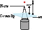
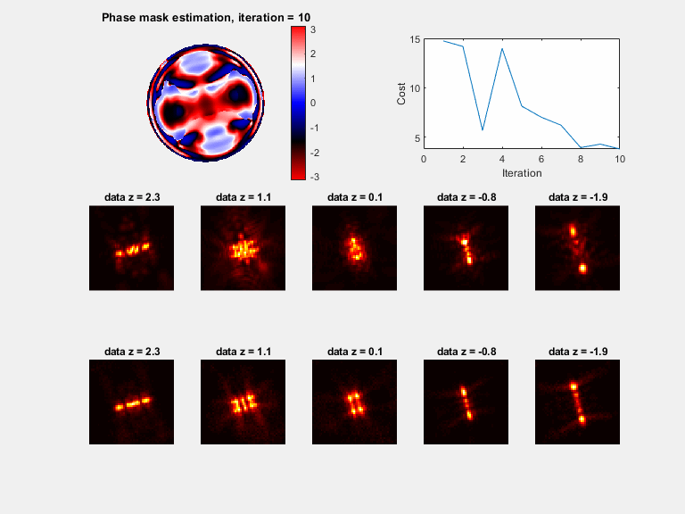
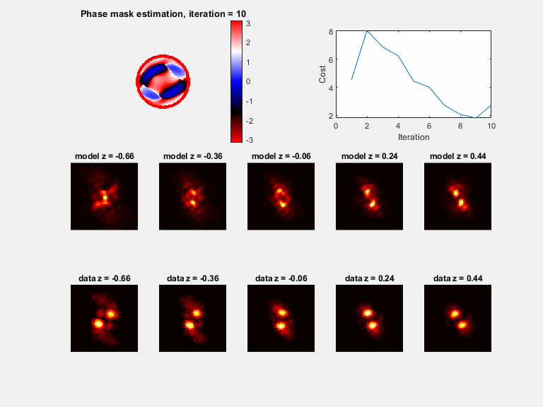

# VIPR - Vectorial Phase Retrieval for microscopy

# Overview: 

This code is associated with the paper : “VIPR: Vectorial Implementation of Phase Retrieval for fast and accurate microscopic pixel-wise pupil estimation 2020”.

The code generates a phase mask from a set of images with pre-defined coordinates ( for a z-stack or any general design), optimized mainly for high NA objectives. 

Open ''Example on TP mask'' for more details on how to use the code. 

# Note on future updates 

This demo is a currently working with 2 examples and and option for user input data; in the near future a GUI will be added for easier use.

# Other software use:

•	Finobj.mat written by Yair M. Altman , used to handles the plots. 

# General guidelines: 
        
•	Evaluation and testing was done on a laptop with I7 8750H CPU and NVIDIA GeForce 2070RTX.

•       Designed on MATLAB 2019a with image processing and optimization toolbox. 

•	Image coordinate system is defined like MATLAB images (x is right and y is down). 



# Work flow:

0) **Download all the files (for demo images, do not move the file locations) except gifs**

1) **Open ''Main''**

2) **Choose data set ( data_set=1 for your data, data_set = 3 for the EPFL challenge Double Helix data and data_set = 2 for demo              TetraPod stack).**

Default: for data_set = 2 :the code opens the folder ‘’TP images’’ and reads the Tiff images starting with the letter ‘’T’’.



for data_set = 3 :the code opens the folder ‘’EPFL challenge DH data’’ and reads images using the activations csv.
        

     
3)  **Access the script ''VIPR_user_input'':**
    This script contains all the required user data which is needed for ''Main.mat'' to run.

* **Part A: this part contains the flags which control the MATLAB code outline:**

    a)	Prior_mask_flag :(default 0) - 1 if you want to start from a pre-defined mask and not from a clear aperture. 

    b)	gpu_flag: 1(default) to run on GPU (CUDA) and 0 for CPU

    c)	vec_model_flag : 1(default) for vectorial model, 0 for scalar ( faster, use for air-objectives).

    d)	cost_function_flag : define cost function to optimize, 1-L1, 2-L2, 3- Poisson MLE, 4- Gaussian MLE (default-see paper) 
        if you want to add a new cost, consult with the author, it is easy to do.

    e)	plot_flag: 1 to visualize results during optimization(default), slows down the code.
    
    f)	Alg_flag: choose gradient descent scheme,  1 - ADAM (default), 2 - Adamax , 3- Nadam, 4 - Nesterov, 5- Vanilla SGD

    g)	vec_model_pol : needed If vec_model_flag=1, choose polarization state ‘x’(default), ‘y’, or ‘b’ for both. 

    h)	noisy_flag: 0- for design PSFs, 1 - for real measurements(default).
    
    i)	est_gBlur_flag : 1(default)- estimate the blur kernel after 1/3 of the iterations, 0 - leave initial guess

    Note: for designing PSFs, it's better to switch to L1 norm ( cost_function_flag = 1 )
    
    j) crop_flag % cropping flag for user data, 1 = point choice, 2= CoG of max projection , 3- no cropping (default)
    note: make sure that the FOV_size parameter is small enough for the choice of center.

* **Part B: define the optical system** 

    Change the parameters to match your optical system.

    Note: for freely rotating dipole, leave polarization vector as zeros. 
          for fixed dipoles, input a normalized vector. 

* **Part C: more advanced optimization parameters.** 

    a)	IS.I_thr_flag : how to  threshold the data - 1 is for thresholding pixels below IS.thr times max(I) per image I, 2 - threshold pixels below IS.thr times the background std.

    b)	IS.I_thr: threshold parameter

    c)	IS.corner_size : size of corners to  estimate noise [pixels]

    d)	IS.SGDiter : how  many iterations to SGD (default 300)

    e)	IS.step_size : step  size (try 3e-1 for ADAM and 3e-8 for SGD)

    f)	IS.point_num : size of mini-batch per SGD iteration (default 3)

    g)	IS.gBlur_cost : cost function  to estimate the gaussian blur kernel if est_gBlur_flag=1, (1-4 same as cost_function_flag , 5 -           by corr2)

    h)	IS.last_iter : how many iterations  to run not with SGD (at end of optimization), at these iterations, the noise and blur are           not randomized. 

    i)	IS.last_iter_flag : 1 - continue SGD (fastest), 2 - global gradient(slowest), 3- batch the lowest correlation points, 4-                 adaptive sampling with side info on corr (Gopal, Siddharth. "Adaptive sampling for SGD by exploiting side information."                 International Conference on Machine Learning. 2016)

    j)	IS.thr_corr : threshold for correlation calc (used if last_iter_flag = 3 or 4), threshold = IS.thr_corr times max(I)

    k)	IS.upsample_fact : (default 1) if you wish to upsample the data, useful if object space pixels are large compared to the               wavelength
        
    l)	IS.update_Signal : 1 - update signal at second half of iterations (might overfit the data, so be careful), 0 - keep the image sum as initial guess
    
    m)  IS.Photobleach_cost_mult : 1 - scale the gradient according to the photobleaching of the source (default 0)

    n)  IS.plotsize : size of psf plots [pixels]

4) **if you want to use your data - open 'VIPR_load_data.m'**

    a) The file choice is automatic when you run Main.m
    
    b) input coordinates associated with the images in any way you want
    
    input size needs to match the number of images loaded,
    
    Default: x=0 ; y = 0 ; z = emitter radius; z_stack_pos - Nominal Focal Plane(NFP) positions (Default - loads NFP mat file for                    TetraPod images)

5) **run ''Main.m''**

# Output (of the script ''Main'')

Plots (if plot_flag = 1)

a)	A phase mask plot will be seen (with modulus of 2*pi), plotted every 30 iterations

b)	Sample PSFs are plotted with the matching model, plotted every 30 iterations

c)	The cost function value, plotted every 30 iterations

d)	Correlation between the model and the measured stack, plotted at the end

e)	A slow visual comparison between the measured stack and model, plotted at the end


Variables output:

a)	maskRec – the phase retrieved mask, unwrapped. 

b)	gB – std of thegaussian blur kernel estimation [pixels]

c)	Nph – vector of estimated image intensities 

d)	I_mod – the reconstructed z-stack.


# Citation

If you use this code for your research, please cite our paper:
```
@article{ferdman2020vipr,
  title={VIPR: Vectorial Implementation of Phase Retrieval for fast and accurate microscopic pixel-wise pupil estimation},
  author={Ferdman, Boris and Nehme, Elias and Weiss, Lucien E and Orange, Reut and Alalouf, Onit and Shechtman, Yoav},
  journal={bioRxiv},
  year={2020},
  publisher={Cold Spring Harbor Laboratory}
}
```

# Contact

To report any bugs, suggest improvements, or ask questions, please contact me at "borisferd@gmail.com"
 


